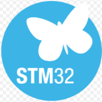

## Hola, Hello, Hallo 👋

My name is Christopher Garcia and I am an Electrical-Electronic Engineer.
I have experience working with microcontrollers and various electronic transducers and devices.

## MCU
I use STM32 MCUs, Texas Instruments (TI), Raspberry Pi, Arduino, ESP32, and more. These devieces are programmed in C/C++, Python and Mycropython.

## Electronic Circuits
I design a wide range of electronic circuits, including multiplexers, decoders, filters, amplifiers, and others.

## STACK
<table>
<tbody>
<tr>
    <td>OS</td>
    <td>
        </a>
            
        </a>
            
        </a>
            
        </a>
            
        </a>
            
        </a>
    </td>
</tr>
<tr>
    <td>Tools</td>
    <td>
        
        
        
        
    </td>
</tr>

<tr>
</tr>
</tbody>
</table>

<!--
**christogarm/ChristoGarm** is a ✨ _special_ ✨ repository because its `README.md` (this file) appears on your GitHub profile.

Here are some ideas to get you started:

- 🔭 I’m currently working on ...
- 🌱 I’m currently learning ...
- 👯 I’m looking to collaborate on ...
- 🤔 I’m looking for help with ...
- 💬 Ask me about ...
- 📫 How to reach me: ...
- 😄 Pronouns: ...
- ⚡ Fun fact: ...
-->
